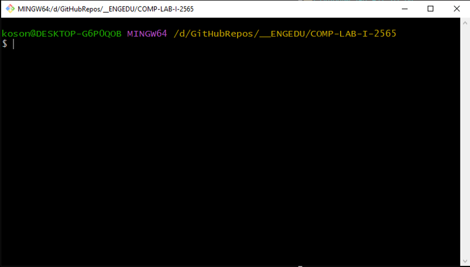
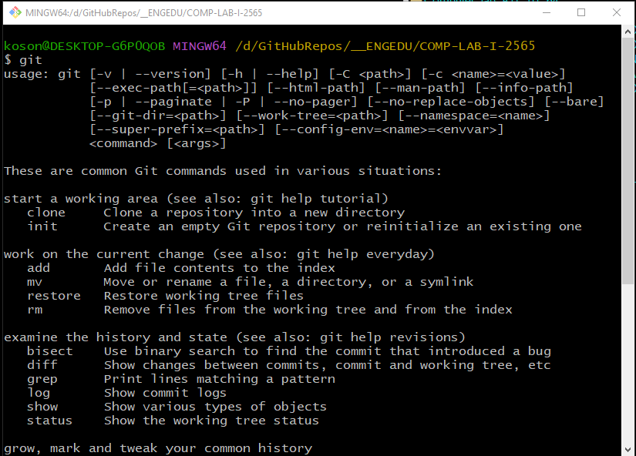
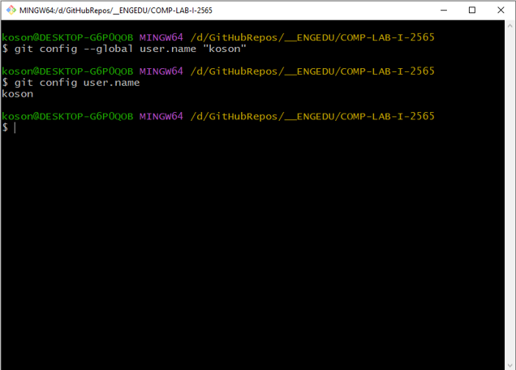
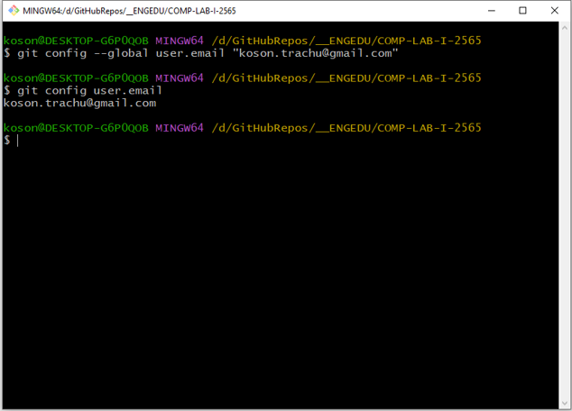
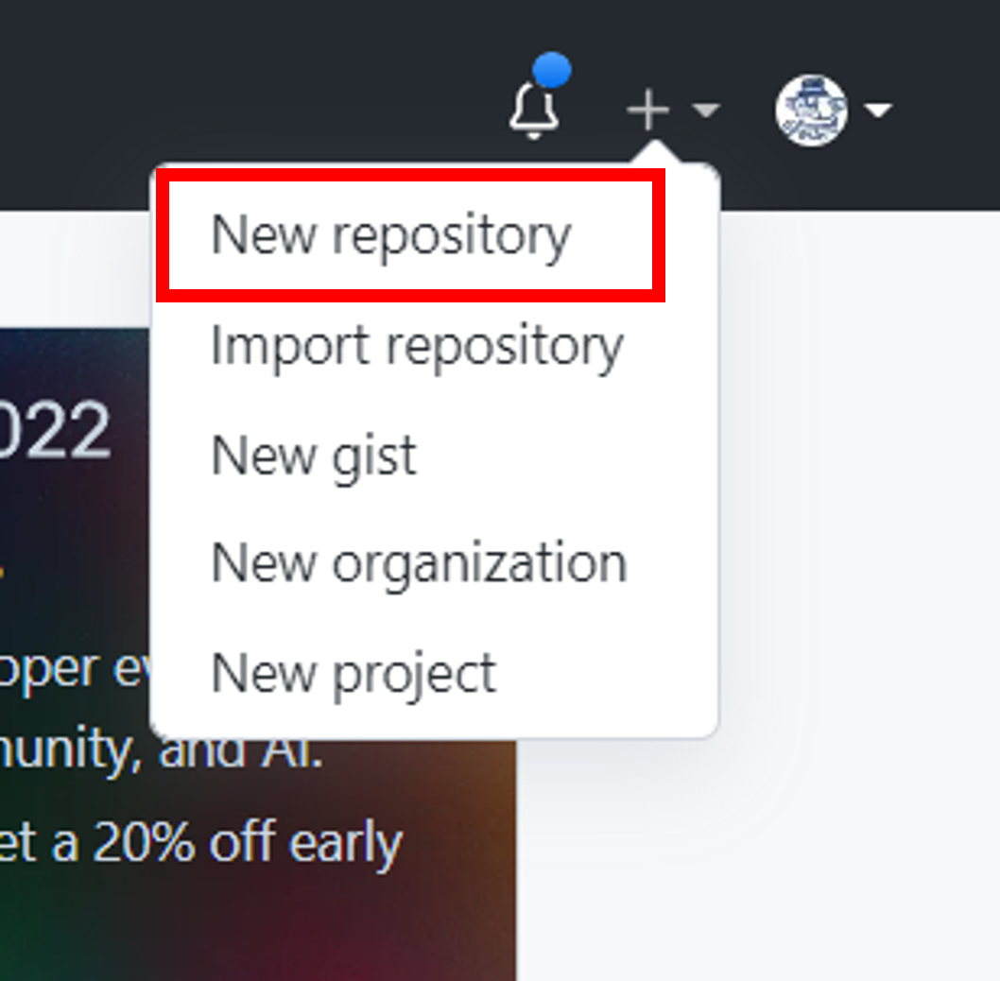
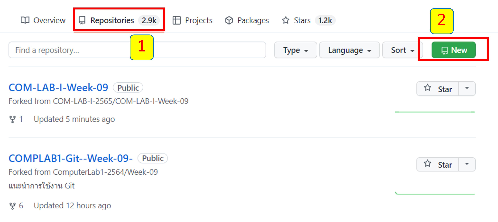
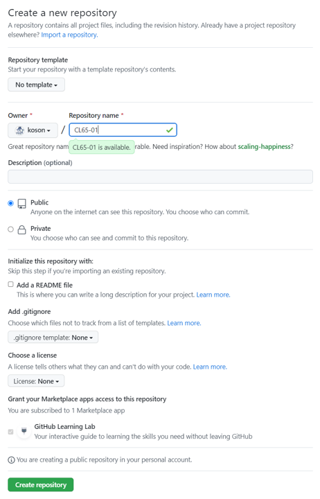
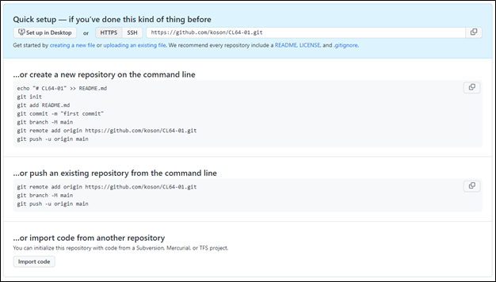

# Week-09  การทดลองเรื่อง การใช้งาน Repository เบื้องต้น #


## ขั้นตอนการทดลอง

## 1. เริ่มใช้งาน Github

ในการใช้งาน Github เราจะต้องมีบัญชีผู้ใช้ของ Github ซึ่งทาง Github จะให้บริการฟรีแบบไม่จำกัดจำนวน repository ซึ่งจะเป็นแบบ public หรือ private ก็ได้ repository แบบ public นั้น จะสามารถมองเห็นได้จากทุกคน ส่วน repository ที่เป็นแบบ private เราจะสามารถกำหนดบุคคลที่อนุญาตให้เห็น repository ของเราได้ ซึ่งจะสะดวกในการทำ project ที่เป็นความลับ

### 1.1 สร้างบัญชีผู้ใช้งานบน Github

การสร้างบัญชีผู้ใช้บน Github ให้ไปที่ https://github.com/join จากนั้น ให้กรอกรายละเอียด ซึ่งชื่อผู้ใช้ (User name) จะถูกนำไปใช้ในหลายๆ ที่ ดังนั้นควรเป็นชื่อที่จำง่ายและพิมพ์ได้สะดวก มิฉะนั้นจะเสียเวลาในการทำงาน   

<p align="center">

</p>
<p align="center"><br> <b> รูปที่ 1.1</b> การสร้างบัญชี Github </p>


### 1.2 ติดตั้งโปรแกรม Git

1.2.1 ดาวน์โหลดโปรแกรม Git จาก https://git-scm.com/downloads โดยเลือกโปรแกรมติดตั้งให้ตรงกับระบบปฏิบัติการที่ใช้  โปรแกรมที่ดาวน์โหลดมา จะมี GUI ให้เราใช้งานด้วยซึ่งมีชื่อเรียกว่า Github desktop แต่ถ้าหากสนใจที่จะใช้ Git GUI Clients ตัวอื่นๆ ก็สามารถศึกษาได้ที่ https://git-scm.com/downloads/guis

1.2.2 ติดตั้งโปรแกรม Git ตามคำแนะนำของโปรแกรมติดตั้ง

1.2.3 เปิดโปรแกรม Git bash จะได้หน้าต่าง terminal ที่ทำงานใน text mode
 
<p align="center">

</p>
<p align="center"><br> <b> รูปที่ 1.2</b> หน้าต่าง terminal ของ git bash </p>

__ผลการทดลอง__

ให้นักศึกษา  capture  หน้าจอของตนเองมาใส่ และอธิบายสั้นๆ ถึงสิ่งที่เกิดขึ้น


1.2.4 ทดสอบว่าสามารถใช้งาน Git บนเครื่องของเราได้หรือไม่ ให้พิมพ์คำสั่งต่อไปนี้

`$ git`

ถ้า terminal ตอบกลับมาว่าไม่รู้จักคำสั่ง git แสดงว่าการติดตั้งยังไม่สมบูรณ์ ให้กลับไปตรวจสอบขั้นตอน 1.2.2 ให้ติดตั้งเรียบร้อย
 
<p align="center">

</p>
<p align="center"><br> <b>  รูปที่ 1.3 </b> ผลการทดลองพิมพ์คำสั่ง git</p>

---

__ผลการทดลอง__

ให้นักศึกษา  capture  หน้าจอของตนเองมาใส่่ตรงนี้ และอธิบายสั้นๆ ถึงสิ่งที่เกิดขึ้น 


_ตัวอย่าง_ 

เมื่อทำการติดตั้งโปรแกรม git แล้วรันคำสั่ง  `git` พบว่าสามารถใช้งานได้ โดยหน้าจอจะมีข้อความดังรูปต่อไปนี้
 <p align="center">  </p>

----


1.2.5 บอกให้ Git รู้จักชื่อของเรา  โดยพิมพ์คำสั่งต่อไปนี้  

``` sh
$ git config --global user.name “USER NAME”
```


ในกรณีที่เราต้องการทราบชื่อผู้ใช้ปัจจุบัน สามารถสั่งให้ Git รายงานออกมาด้วยการพิมพ์คำสั่งต่อไปนี้


``` sh
$ git config user.name
``` 
<p align="center"> 
</p>

<p align="center"><br> <b>  รูปที่ 1.4 </b>git config --global user.name

---
__ผลการทดลอง__

ให้นักศึกษา  capture  หน้าจอของตนเองมาใส่ และอธิบายสั้นๆ ถึงสิ่งที่เกิดขึ้น

---

1.2.6 บอกให้ Git รู้จัก email ของเรา  โดยพิมพ์คำสั่งต่อไปนี้

``` sh
$ git config --global user.email “USER EMAIL ADDRESS”
```

ในกรณีที่เราต้องการทราบชื่อผู้ใช้ปัจจุบัน สามารถสั่งให้ Git รายงานออกมาด้วยการพิมพ์คำสั่งต่อไปนี้

```
$ git config user.email
```

หมายเหตุ  email ที่ใช้จะต้องตรงกับ email ที่ลงทะเบียนไว้กับ Github มิฉะนั้นจะไม่สามารถเขียนข้อมูลขึ้นไปบน server ได้ 
เมื่อทำในขั้นตอน 1.2.5 และ 1.2.6 เรียบร้อยแล้ว การทำงานใดๆ บน Github ก็จะปรากฏชื่อและ Email ของเรากำกับไว้เสมอ 

 
<p align="center"> </p>

<p align="center"><br> <b>  รูปที่ 1.5</b> git config --global user.email


---
__ผลการทดลอง__

ให้นักศึกษา  capture  หน้าจอของตนเองมาใส่ และอธิบายสั้นๆ ถึงสิ่งที่เกิดขึ้น

---

### 1.3 สร้าง repository (บน server)
Repository เป็นพื้นที่สำหรับเก็บ project ของเรา ซึ่งไม่ได้หมายความถึงเฉพาะ source code เท่านั้น repository ยังสามารถประกอบด้วยไฟล์ทุกชนิด ไม่ว่าจะเป็น Word Document, spread sheet, presentation, เอกสารการออกวิเคราะห์และออกแบบซอฟต์แวร์ ไฟล์มีเดียภาพและเสียง รวมไปถึงเอกสาร Wiki ในลักษณะ html ด้วย ดังนั้น ในการทำโครงการพัฒนาซอฟต์แวร์ เราสามารถนำทุกสิ่งที่จำเป็นสำหรับการทำงาน มาใส่ไว้ใน repository  และเมื่อเพื่อนร่วมทีมหรือ user ใดๆ ทำสำเนา repository ของเราไป เขาก็จะได้ทุกสิ่งทุกอย่างไปอย่างครบถ้วน ดังนั้นจึงอาจพูดได้ว่าเราสามารถใช้ repository เป็นเครื่องมือบริหารโครงการที่มีประสิทธิภาพได้เช่นกัน

1.3.1 การสร้าง repository บน Github สามารถสร้างได้หลายวิธีด้วยกัน เช่น
(1) การสร้าง repository โดยการคลิกที่ปุ่มเครื่องหมาย “+” ที่ด้านบนขวาของหน้าเพจ  Github แล้วเลือก  new repository

  <p align="center"> </p>

<p align="center"><br> <b> รูปที่ 1.6 </b>การสร้าง repository โดยการคลิกที่ปุ่มเครื่องหมาย “+” 

(2) การสร้าง repository โดยการคลิกที่ปุ่ม New สีเขียว 

  <p align="center"> </p>
<p align="center"><br> <b> รูปที่ 1.7 </b> การสร้าง repository โดยการคลิกที่ปุ่ม New

(3) การสร้าง repository โดยลิงค์ https://github.com/new

นอกจาก 3 วิธีข้างต้น ซึ่งจะพาเราไปสร้าง repository บนเว็บแล้ว เรายังสามารถสร้าง repository โดยใช้ command line บน terminal (ศึกษาได้จาก adding-an-existing-project-to-github-using-the-command-line )

1.3.2 กำหนดชื่อและชนิดของ repository
	การใช้วิธีการ 3 วิธีแรก ในข้อ 1.3.1 จะได้ผลอย่างเดียวกัน คือ Github จะพามาหน้าสำหรับสร้าง repository
-	ในช่อง Repository name ให้ใส่ชื่อของ repository เนื่องจากบ่อยครั้งที่เราต้องใช้งานคำสั่งต่าง ๆ บน terminal ซึ่งต้องพิมพ์ชื่อ repository เอง ดังนั้นชื่อของ repository จะต้องมีความหมายในตัว เข้าใจง่าย กระชับ
-	ในช่อง Description (optional) เพิ่มคำอธิบายสั้นๆ เกี่ยวกับ repository เพื่อให้ชาวโลกอ่านแล้วเห็นภาพรวมของ  repository ได้อย่างรวดเร็ว  
-	ชนิดของ repository นั้น ถ้าหากเป็นโปรเจคที่เป็นความลับ ไม่อาจเปิดเผยต่อชาวโลกได้ เช่นประกอบด้วยฐานข้อมูลในงานวิจัย คะแนนแล็บของนักศึกษา ชื่อ URL, user name, password ที่เขียนลงไปใน source code  เราก็อาจจะเลือกเป็น private ซึ่งอาจจะต้องมีค่าใช้จ่ายในการสมัครสมาชิกพิเศษ หรือไม่ก็ต้องเป็น academic account ในที่นี้ให้เลือกเป็น public
-	ถ้าเราทำเครื่องหมาย ☑ หน้าข้อความ Initialize this repository with a README เพื่อให้เราสามารถเขียนบรรยายคร่าวๆ เกี่ยวกับ repository ได้
-	เดี๋ยวก่อน…. ในขั้นตอนนี้ ยังไม่ต้องทำเครื่องหมาย ☑ เพราะเราจะทดลองสร้างโดยใช้ command line tool
-	เลือกว่าจะเพิ่ม .gitignore หรือ license file ด้วยหรือไม่ โดย .gitignore นี้จะบอก Git ว่าไม่ต้องสนใจที่จะติดตามไฟล์ชนิดใดบ้าง โดย Git จะกำหนดชนิดของไฟล์ให้เบื้องต้น เช่น ถ้าเราเลือก .gitignore เป็น ภาษา C++ แล้ว Git จะเพิ่มชนิดของไฟล์ต่างๆ ที่เป็นผลจากการคอมไพล์ไว้ในรายการที่เพิกเฉย (เช่น ไฟล์ที่มีนามสกุล .exe)  ซึ่งไฟล์เหล่านั้น มักจะเกิดจากการคอมไพล์โปรแกรม ไม่ใช่ไฟล์ที่เราเป็นคนแก้ไข source code จึงไม่จำเป็นที่จะต้องนำไปเก็บบน repository ให้สิ้นเปลืองพื้นที่ สามารถดูเทมเพลตของ .gitignore ได้จาก A collection of useful .gitignore templates 
-	ยังไม่ต้องเลือก.gitignore เช่นเดียวกัน
 
<p align="center"> </p>

<p align="center"><br> <b> รูปที่ 1.8 </b>การสร้าง repository 

---

__ผลการทดลอง__

ให้นักศึกษา  capture  หน้าจอของตนเองมาใส่ และอธิบายสั้นๆ ถึงสิ่งที่เกิดขึ้น

---

-	คลิกปุ่ม Create repository สีเขียว
	Github  จะสร้าง repository ให้ตามต้องการ


 
<p align="center"> </p>
<p align="center"><br> <b> รูปที่ 1.9 </b>repository ที่ได้จากการสร้างในข้อ 1.3</p>

---

__ผลการทดลอง__

ให้นักศึกษา  capture  หน้าจอของตนเองมาใส่ และอธิบายสั้นๆ ถึงสิ่งที่เกิดขึ้น

---


หมายเหตุ ให้เปิดหน้าเพจนี้ค้างไว้ เพราะเราต้องมาดูผลการเปลี่ยนแปลงในภายหลัง

### 1.4 สร้าง git บนเครื่องคอมพิวเตอร์ (Local)