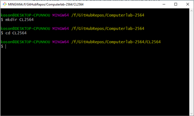
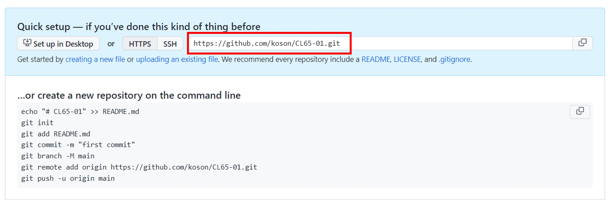
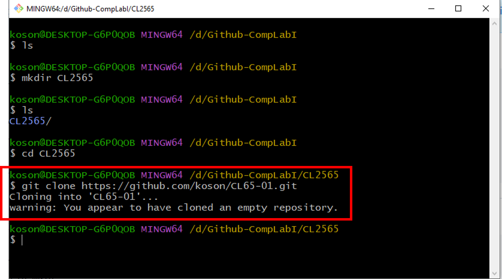
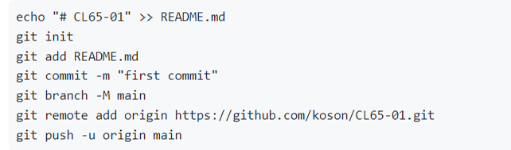
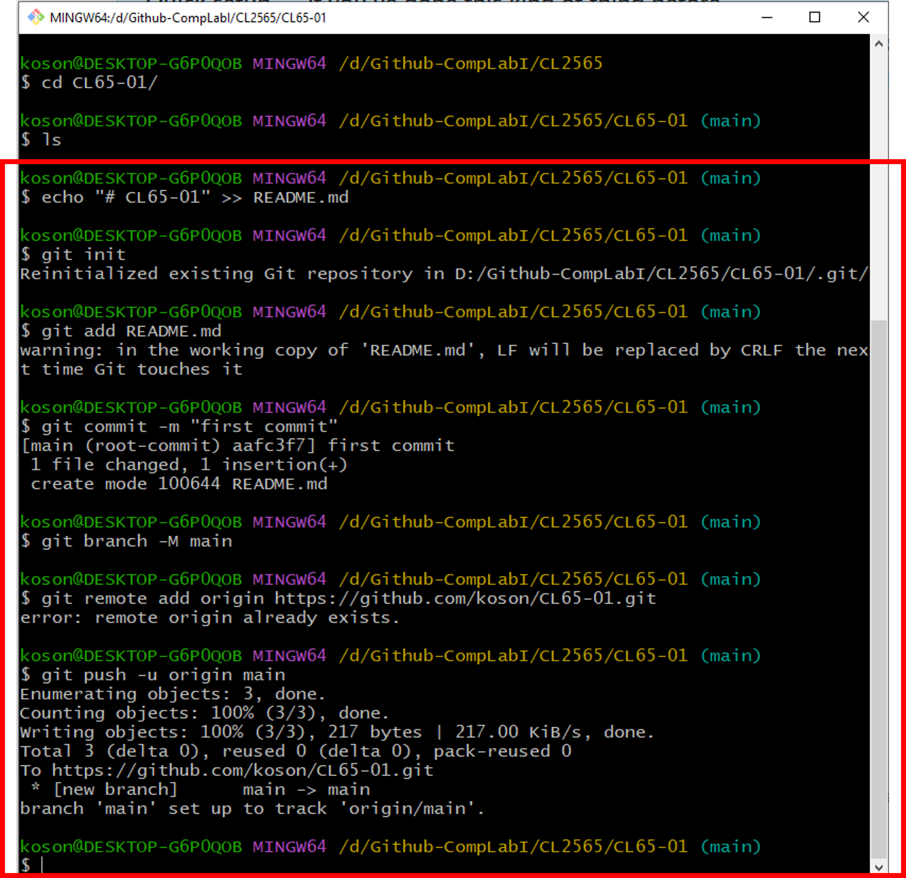
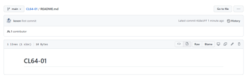

# Week-09  การทดลองเรื่อง การใช้งาน Repository เบื้องต้น #


### 1.4 สร้าง git บนเครื่องคอมพิวเตอร์ (Local)

Repository ที่สร้างขึ้นในข้อ 1.3 นั้น เป็น repository ที่อยู่บน server ในขณะที่เรากำลังแก้ไข source  code  ซึ่งมักจะเป็นการแก้ไขเล็ก ๆ น้อย ๆ การทำงานของ git จะเน้นทำงานที่ local เป็นหลัก ต่อเมื่อเราได้พัฒนา source code จนถึงจุดหนึ่ง ที่คิดว่าสามารถเผยแพร่ เพื่อการทดสอบหรือใช้งาน เราจึงส่งขึ้นไปเก็บบน  server

การทำสำเนาของ repository มาไว้บนเครื่อง (local)  สามารถทำได้หลายวิธี ซึ่งเบื้องต้นนี้ เราจะศึกษาโดยการใช้งาน command line ซึ่งอาจจะพบกับความยุ่งยากบ้างในตอนแรกๆ แต่เมื่อใช้บ่อย ๆ จนชำนาญจะพบว่ามีความยืดหยุ่นสูงกว่าการใช้ GUI Clients หรือเมื่อศึกษาจนเข้าใจแล้วหันไปใช้ GUI Clients ก็จะสามารถเข้าใจถึงการทำงานของระบบ Git อย่างแท้จริง
1.4.1 การ clone repository ด้วย command line (git bash)
1)	การเตรียมการเบื้องต้น
-	ในหน้าต่าง git bash ให้พิมพ์คำสั่ง list ดูรายการของไฟล์และโฟลเดอร์

``` sh
$ ls
```

เราจะเห็นรายการไฟล์ถูกแสดงขึ้นมา

---
__ผลการทดลอง__


ให้นักศึกษา  capture  หน้าจอของตนเองมาใส่ และอธิบายสั้นๆ ถึงสิ่งที่เกิดขึ้น

---

-	สร้างโฟลเดอร์สำหรับเก็บงานในวิชาการทดลอง (ในที่นี้ชื่อว่า CL2565 ย่อมาจาก Computer Laboratory 2565) โดยใช้คำสั่ง

``` sh
$ mkdir CL2565
```
-	ย้ายเข้าไปอยู่ในโฟลเดอร์ที่สร้างขึ้น โดยใช้คำสั่ง

``` sh
$ cd CL2565
```	
สังเกตุได้จาก  git bash จะแสดงชื่อของโฟลเดอร์ปัจจุบันเป็นดังรูปที่ 10


 
<p align="center"> </p>

<p align="center"><br> <b> รูปที่ 10 </b> หน้าต่าง terminal ของ git bash เตรียมพร้อมสำหรับการ clone 

--- 
__ผลการทดลอง__

ให้นักศึกษา  capture  หน้าจอของตนเองมาใส่ และอธิบายสั้นๆ ถึงสิ่งที่เกิดขึ้น

---

2)	การทำสำเนา repository มาไว้บนเครื่องโดยการ clone
-	ทำสำเนา repository มาไว้บนเครื่องโดยใช้คำสั่งที่มีรูปแบบดังต่อไปนี้

```
$ git clone https://github.com/[YOUR USERNAME]/[YOUR REPOSITORY NAME]
```
`[YOUR USERNAME]` คือ username ของเราบน github
`[YOUR REPOSITORY NAME]` คือชื่อ repository ของเราที่สร้างในข้อ 1.3  

ถ้าจำไม่ได้ ก็ไม่เป็นไร ให้เข้าไปที่ repository ที่เพิ่งสร้างบน Github  (ดูรูปที่ 9) จะเห็นว่ามี URL ของ repository สำหรับการโคลน ดังรูปที่ 11 ให้เรากดปุ่ม copy ที่อยู่ด้านขวามือของ url
 

 <p align="center"> </p>

<p align="center"><br> <b> รูปที่ 11 </b>URL สำหรับการ clone repository

--- 
__ผลการทดลอง__

ให้นักศึกษา  capture  หน้าจอของตนเองมาใส่ และอธิบายสั้นๆ ถึงสิ่งที่เกิดขึ้น

---

-	ใน git bash ให้พิมพ์คำสั่ง git clone ตามด้วย URL ที่คัดลอกมา
-	เมื่อทำการ clone เรียบร้อย จะได้ผลดังรูปที่ 12


 <p align="center"> </p>
<p align="center"><br> <b> รูปที่ 12 </b>ผลการ clone repository

--- 
__ผลการทดลอง__

ให้นักศึกษา  capture  หน้าจอของตนเองมาใส่ และอธิบายสั้นๆ ถึงสิ่งที่เกิดขึ้น

---


-	เรียกดูรายการโฟลเดอร์ (ด้วยคำสั่ง ls) และเปลี่ยนโฟลเดอร์ (ด้วยคำสั่ง change directory :cd)

--- 
__ผลการทดลอง__

ให้นักศึกษา  capture  หน้าจอของตนเองมาใส่ และอธิบายสั้นๆ ถึงสิ่งที่เกิดขึ้น

---


ตอนแรกจะพบว่ามีโฟลเดอร์ชื่อ CL65-01 ซึ่งถูก clone มาจาก server จึงย้ายเข้าไปในโฟลเดอร์นั้น แล้วจึงสั่ง ls เพื่อดูรายการไฟล์ พบว่า repository ของเราจะยังว่างเปล่า ดังรูปที่ 13
 
 <p align="center"> </p>
  
<p align="center"><br> <b> รูปที่ 13 </b>ไฟล์ที่ถูก clone มาจาก repository

--- 
__ผลการทดลอง__

ให้นักศึกษา  capture  หน้าจอของตนเองมาใส่ และอธิบายสั้นๆ ถึงสิ่งที่เกิดขึ้น

---

- ให้พิมคำสั่งต่อไปนี้ ครั้งละบรรทัด (พิมพ์ให้ครบบรรทัดแล้วเคาะ enter)

  <p align="center"> </p>

<p align="center"><br> <b> รูปที่ 14  (ก) </b>การเพิ่มไฟล์ README.md ให้กับ repository

  <p align="center"> </p>

<p align="center"><br> <b> รูปที่ 14  (ข) </b> การพิมพ์คำสั่งใน git bash


--- 
__ผลการทดลอง__

ให้นักศึกษา  capture  หน้าจอของตนเองมาใส่ และอธิบายสั้นๆ ถึงสิ่งที่เกิดขึ้น

---


จากรูปที่ 14 จะได้ผลการทำงานดังรูปที่ 15 ซึ่งจะเห็นว่า บางคำสั่งอาจจะมี error เกิดขึ้น เนื่องจากมี repository อยู่บน server แล้ว แต่ก็ให้ทำให้ครบทุกขั้นตอนไปก่อน เพราะ ในกรณีนี้  error เหล่านั้นไม่ส่งผลกระทบร้ายแรงต่อการทำงาน

-	ให้กลับไปที่ browser และกด refresh 1 ครั้ง จะเห็นว่าหน้า repository ที่เราเพิ่งสร้าง จะเปลี่ยนไป

 
  <p align="center"> </p>

<p align="center"><br> <b> รูปที่ 15 </b>หน้าเพจ repository ที่เปลี่ยนไปหลังจากเพิ่มไฟล์ README.md

--- 
__ผลการทดลอง__

ให้นักศึกษา  capture  หน้าจอของตนเองมาใส่ และอธิบายสั้นๆ ถึงสิ่งที่เกิดขึ้น

---

### 1.5 การแก้ไขงานและบันทึกการเปลี่ยนแปลงบน local computer
