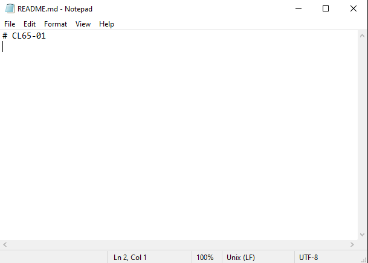
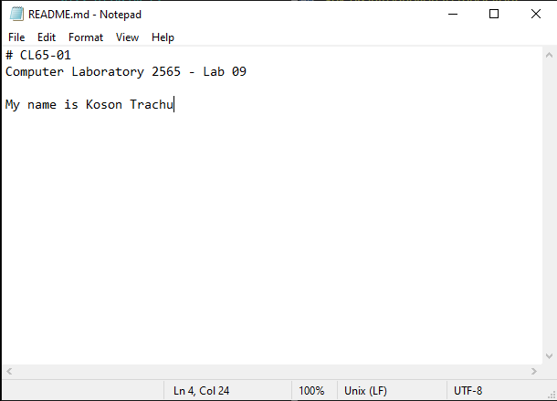
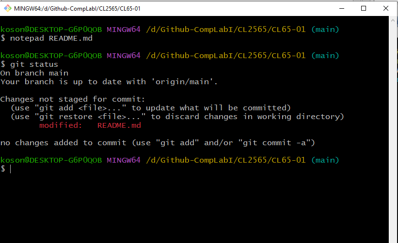
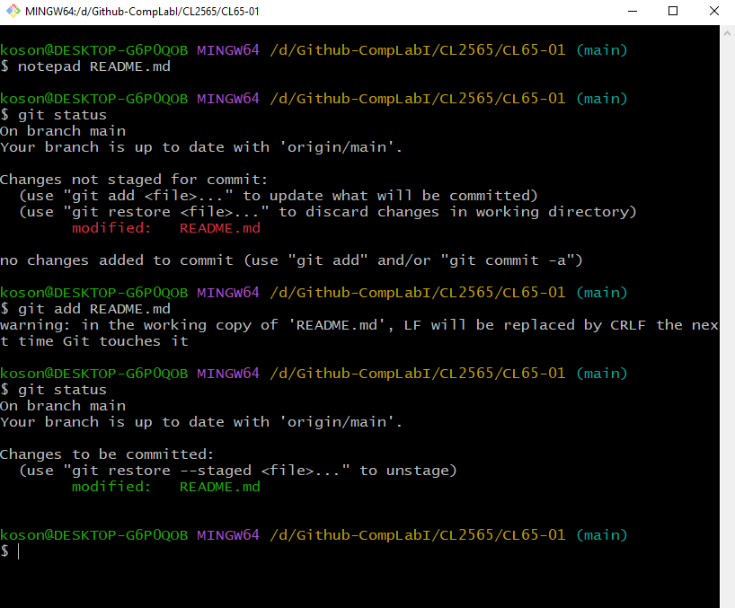
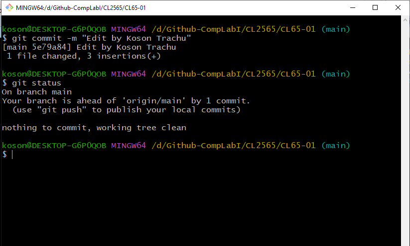

# [Week-09  การทดลองเรื่อง การใช้งาน Repository เบื้องต้น #](README.md)


### 1.5 การแก้ไขงานและบันทึกการเปลี่ยนแปลงบน local computer
ถึงตอนนี้ เนื้อหาในไฟล์ README.md บน server และ local computer จะเหมือนกันทุกประการ เนื่องจากเป็นการ clone มาและยังไม่ได้ทำการแก้ไขใดๆ อีกทั้งเรามั่นใจว่าไม่มีผู้ใช้คนอื่นๆ กำลังแก้ไขงานของเราบน server  (ซึ่งการแก้ไขงานร่วมกันบน server จะอยู่ในการทดลองถัดไป)  เราสามารถแก้ไขและทำ revision ของเอกสารได้ตามต้องการ โดยการเปลี่ยนแปลงต่างๆ จะเกิดขึ้นบนเครื่อง  local computer เท่านั้น

1.5.1 ทดลองแก้ไขไฟล์ README.md

โดยส่วนใหญ่ ในการเขียนโปรแกรม มักจะกระทำบนโปรแกรม Integrated development environment หรือเรียกสั้นๆ ว่า IDE  แต่ในการทดลองนี้ จะใช้โปรแกรมแก้ไขเอกสารอย่างง่ายๆ นั่นคือโปรแกรม Notepad.exe
-	ให้พิมพ์คำสั่งต่อไปนี้ลงใน  git bash

```sh
$ notepad README.md
```

ระบบจะเปิด text editor ที่มากับระบบปฏิบัติการ Windows ดังรูปที่ 16

<p align="center"> </p>

<p align="center"><br> <b> รูปที่ 16 </b>การใช้โปรแกรม notepad.exe แก้ไขไฟล์ README.md

--- 
__ผลการทดลอง__

ให้นักศึกษา  capture  หน้าจอของตนเองมาใส่ และอธิบายสั้นๆ ถึงสิ่งที่เกิดขึ้น

---

-	แก้ไขไฟล์ README.md  ใน notepad  โดยเพิ่มข้อความลงไปดังตัวอย่าง (ให้นักศึกษาใส่ชื่อตนเอง)

 
<p align="center"> </p>

<p align="center"><br> <b> รูปที่ 17 </b>แก้ไขไฟล์ README.md โดยเพิ่มบรรทัดต่อท้ายเข้าไป

--- 
__ผลการทดลอง__

ให้นักศึกษา  capture  หน้าจอของตนเองมาใส่ และอธิบายสั้นๆ ถึงสิ่งที่เกิดขึ้น

---

-	บันทึกและปิดโปรแกรม notepad.exe
-	ตรวจสอบการเปลี่ยนแปลงใน git bash โดยพิมพ์คำสั่ง git status แล้วสังเกตุผลที่ได้จากการรันคำสั่ง

``` sh
$ git status
``` 
<p align="center"> </p>
<p align="center"><br> <b> รูปที่ 18 </b>การตรวจสอบสถานะของ git

จะพบว่า git  ได้ทำการติดตามการเปลี่ยนแปลง  (tracking)  ของไฟล์ต่างๆ ใน repository ของเราอยู่เสมอ ถึงแม้จะเป็น local computer ก็ตาม (ไม่นับไฟล์ใน .gitignore)

--- 
__ผลการทดลอง__

ให้นักศึกษา  capture  หน้าจอของตนเองมาใส่ และอธิบายสั้นๆ ถึงสิ่งที่เกิดขึ้น

---

1.5.2 บันทึกการเปลี่ยนแปลงบน local computer
ถึงตรงนี้ ถ้าเราต้องการจะแก้ไขต่อ ก็สามารถทำได้ แต่การเปลี่ยนแปลงต่างๆ จะไม่สามารถถูกติดตามโดย git ถ้าต้องการให้ git บันทึก (หรือนับ) การเปลี่ยนแปลงเป็นรุ่นหนึ่งๆ ของ source code สามารถทำได้โดยการ commit การเปลี่ยนแปลงลงใน local repository ซึ่งการใช้งานเบื้องต้นจะมี 2 คำสั่งคือ ```git add``` และ ```git commit```
-	เพิ่มไฟล์ที่เปลี่ยนแปลง เข้าสู่รายการ commit โดยใช้คำสั่งต่อไปนี้

``` sh
$ git add README.md
```
	 ตรวจสอบการเปลี่ยนแปลงใน git bash โดยพิมพ์คำสั่ง git status แล้วสังเกตุผลที่ได้จากการรันคำสั่ง

--- 
__ผลการทดลอง__

ให้นักศึกษา  capture  หน้าจอของตนเองมาใส่ และอธิบายสั้นๆ ถึงสิ่งที่เกิดขึ้น

---


``` sh
$ git status
```
 
<p align="center"> </p>
<p align="center"><br> <b> รูปที่ 19 </b>การตรวจสอบสถานะของ git / ผลจากการทำคำสั่ง git add  

หมายเหตุ หากมีการแก้ไขหลายๆ ไฟล์ เราอาจใช้คำสั่ง  git add --all แทนการใช้ชื่อไฟล์ได้
-	Commit ไฟล์ที่เปลี่ยนแปลง เข้าสู่ repository โดยใช้คำสั่งต่อไปนี้

``` sh
$ git commit -m “Edited by <your user name>”
```
ตามด้วยการตรวจสอบสถานะของ repository

``` sh
$ git status
```
จะได้ผลดังนี้

 
<p align="center"> </p>
<p align="center"><br> <b> รูปที่ 20 </b>ผลจากการทำ git commit  

--- 
__ผลการทดลอง__

ให้นักศึกษา  capture  หน้าจอของตนเองมาใส่ และอธิบายสั้นๆ ถึงสิ่งที่เกิดขึ้น

---


หมายเหตุ  รูปแบบของการ commit ประกอบด้วย คำสั่ง  ```git commit -m “THIS IS A COMMIT MESSAGE”``` โดยที่ commit message ควรเป็นข้อความที่สื่อความหมาย มีความยาวไม่มากนัก แต่ไม่สั้นจนเกินไป ควรหลีกเลี่ยงคำทีไม่สื่อความหมาย เช่น “1”, “2”  หรือ “a” ถึงแม้ว่า git จะอนุญาตให้ใช้ก็ตาม เนื่องจากเมื่อพัฒนาไปหลายๆ รุ่น จะไม่สามารถทำความเข้าใจเหตุผลที่แก้ไข source code นั้น ๆ ได้ และในการเปลี่ยนแปลงแต่ละครั้ง git จะนำ commit message นี้ไปใช้ร่วมกับการเปลี่ยนแปลงเสมอ

### [1.6 การซิงค์การเปลี่ยนแปลงระหว่าง local computer และ server](4.Sync-Local-Server.md)