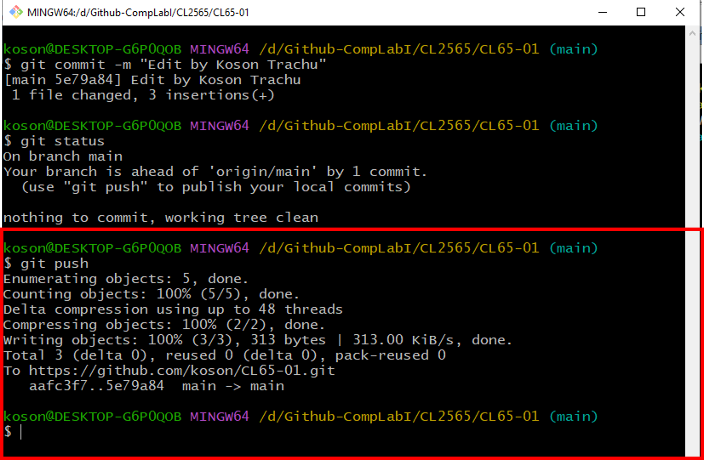
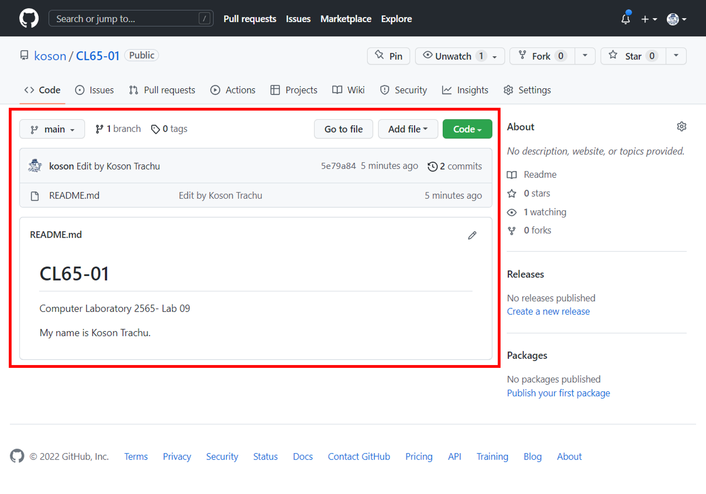
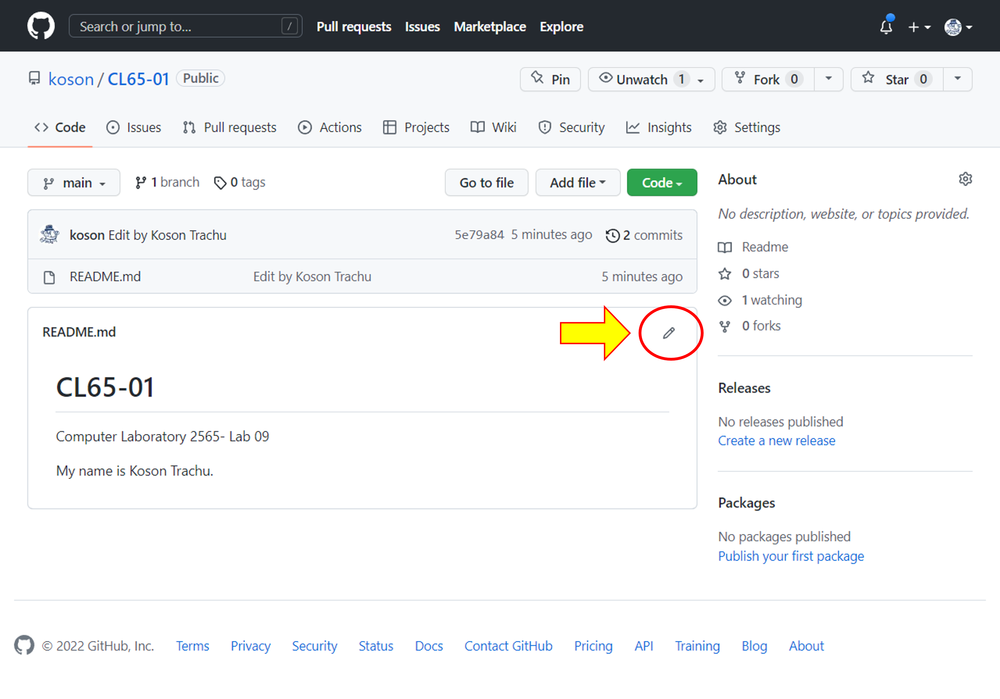
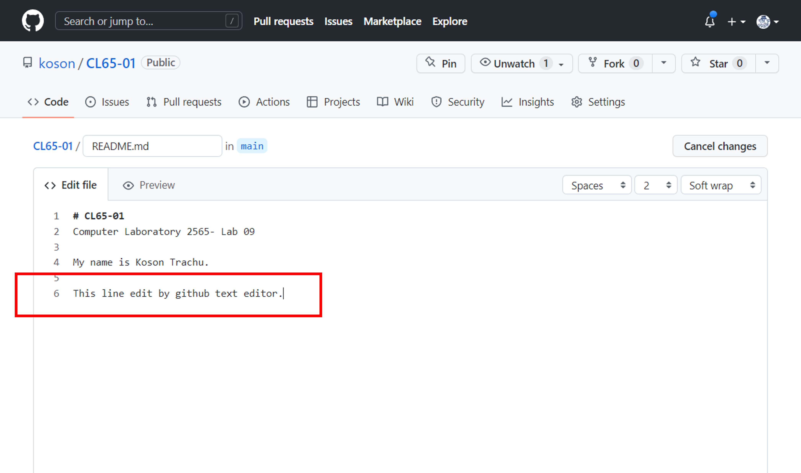
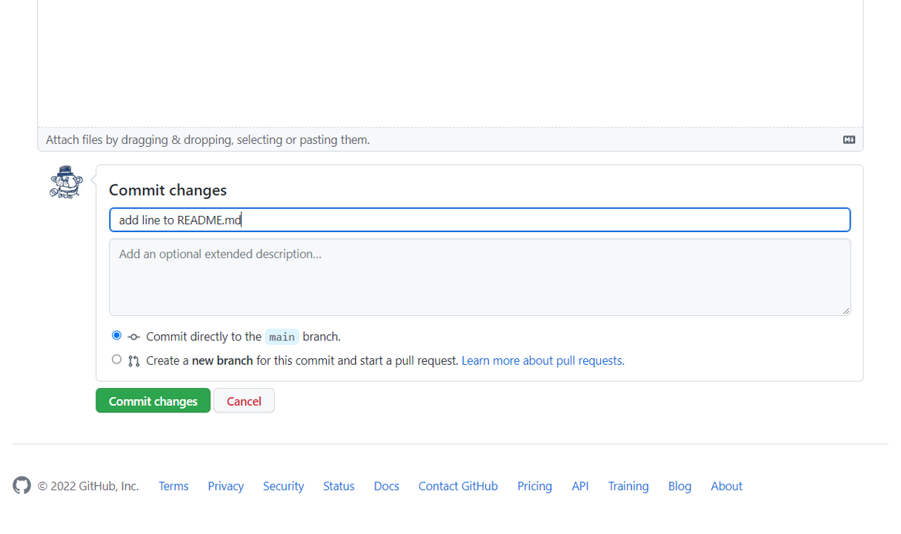
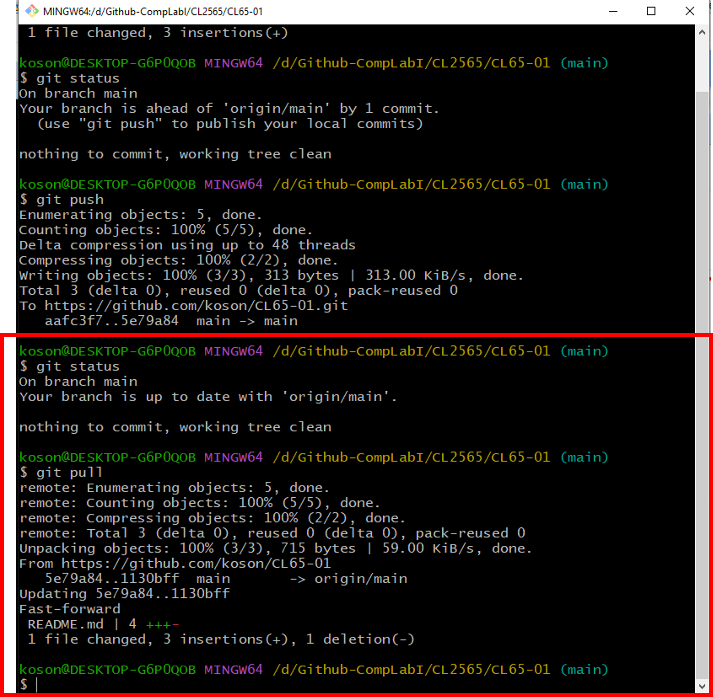
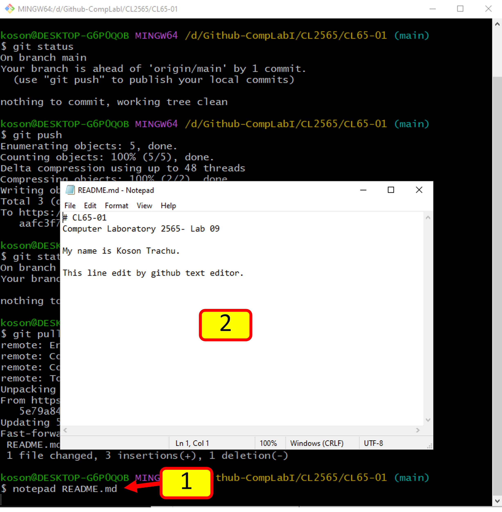

# [Week-09  การทดลองเรื่อง การใช้งาน Repository เบื้องต้น #](README.md)


### 1.6 การซิงค์การเปลี่ยนแปลงระหว่าง local computer และ server
หลังจากที่เราได้ทำการ  clone repository มาที่ local  computer แล้ว การแก้ไขงานทั้งหมด สามารถทำได้บน local computer ได้โดยไม่ต้องเชื่อมต่อกับ server แต่ในบางครั้งที่มีการทำงานร่วมกันเป็นทีม จะต้องปรับปรุง source code ให้เป็นปัจจุบันอยู่เสมอ จะต้องมีการ sync กับ server ได้แก่การ upload การเปลี่ยนแปลงขึ้นสู่ server (เรียกว่าการ push) และการ download การเปลี่ยนแปลงมาจาก server (เรียกว่าการ pull)

1.6.1 การ push ขึ้นสู่ server
โดยทั่วไป การที่จะ push ขึ้นสู่ server เรามักจะใช้คำสั่ง 3 คำสั่งควบคู่กันคือ (1) `git add --all`,  (2)` git commit -m “Commit message”` และ (3) `git push` แต่ในการทดลองที่ผ่านมา เราทำใน (1) และ (2) ไปแล้ว ดังนั้น ให้พิมพ์คำสั่งต่อไปนี้ เพื่อ push repository ขึ้น server

$ git push
จะได้ผลลัพธ์คล้ายตัวอย่างในรูปที่ 20

 
<p align="center"> </p>
<p align="center"><br> <b> รูปที่ 21 </b>ผลจากการทำคำสั่ง git push

--- 
__ผลการทดลอง__
ให้นักศึกษา  capture  หน้าจอของตนเองมาใส่ และอธิบายสั้นๆ ถึงสิ่งที่เกิดขึ้น

---

เมื่อเราทำการ push repository ขึ้นสู่ server แล้ว ก็ต้องทดสอบผลจากการ push  โดยการไป refresh web browser ที่สร้าง repository ไว้ ดังรูปที่ 15

 
<p align="center"> </p>
<p align="center"><br> <b> รูปที่ 22 </b>การเปลี่ยนแปลงที่เกิดขึ้นบน server


--- 
__ผลการทดลอง__
ให้นักศึกษา  capture  หน้าจอของตนเองมาใส่ และอธิบายสั้นๆ ถึงสิ่งที่เกิดขึ้น

---


1.6.2 การ pull มาจาก server
-	การเปลี่ยนแปลงใดๆ ที่เกิดขึ้นบน local computer จะถูกส่งขึ้นมาเก็บด้วยคำสั่ง git push และถ้ามีการแก้ไขไฟล์ใด ๆ เกิดขึ้นบน server เราก็สามารถที่จะดึงกลับไปทำงานที่ local computer ได้เช่นกัน 
-	ให้แก้ไขไฟล์ README.md โดยการคลิกที่ชื่อไฟล์ และปุ่มปากกาบริเวณด้านขวามือ

 
<p align="center"> </p>
<p align="center"><br> <b> รูปที่ 23 </b>เข้าสู่โหมดการแก้ไขไฟล์ด้วย Github Text Editor

--- 
__ผลการทดลอง__
ให้นักศึกษา  capture  หน้าจอของตนเองมาใส่ และอธิบายสั้นๆ ถึงสิ่งที่เกิดขึ้น

---


-	เพิ่มข้อความที่บรรทัดล่างสุดดังตัวอย่าง


 
<p align="center"> </p>
<p align="center"><br> <b> รูปที่ 24 </b>เพิ่มข้อความบางอย่างใน Github Text Editor

--- 
__ผลการทดลอง__
ให้นักศึกษา  capture  หน้าจอของตนเองมาใส่ และอธิบายสั้นๆ ถึงสิ่งที่เกิดขึ้น

---


-	เพิ่มข้อความในช่อง Commit changes และกดปุ่ม Commit changes สีเขียว

 
<p align="center"> </p>
<p align="center"><br> <b> รูปที่ 25 </b>เพิ่มข้อความ Commit changes

--- 
__ผลการทดลอง__
ให้นักศึกษา  capture  หน้าจอของตนเองมาใส่ และอธิบายสั้นๆ ถึงสิ่งที่เกิดขึ้น

---


-	กลับมาที่ git bash พิมพ์คำสั่ง git status สังเกตุผลการทำงาน

```sh
$ git status
```
-	ที่ git bash พิมพ์คำสั่ง git pull 

```sh
$ git pull
```

 
<p align="center"> </p>
<p align="center"><br> <b> รูปที่ 26 </b>การใช้คำสั่ง git pull

--- 
__ผลการทดลอง__
ให้นักศึกษา  capture  หน้าจอของตนเองมาใส่ และอธิบายสั้นๆ ถึงสิ่งที่เกิดขึ้น

---


-	ดูการเปลี่ยนแปลงในไฟล์ README.md
``` sh
$ notepad.exe README.md
```
 
<p align="center"> </p>
<p align="center"><br> <b> รูปที่ 27 </b></b>การเปลี่ยนแปลงในไฟล์เอกสาร  README.md

--- 
__ผลการทดลอง__
ให้นักศึกษา  capture  หน้าจอของตนเองมาใส่ และอธิบายสั้นๆ ถึงสิ่งที่เกิดขึ้น

---

### [1.7 การตรวจสอบประวัติการเปลี่ยนแปลงของไฟล์](5.Change-history.md)