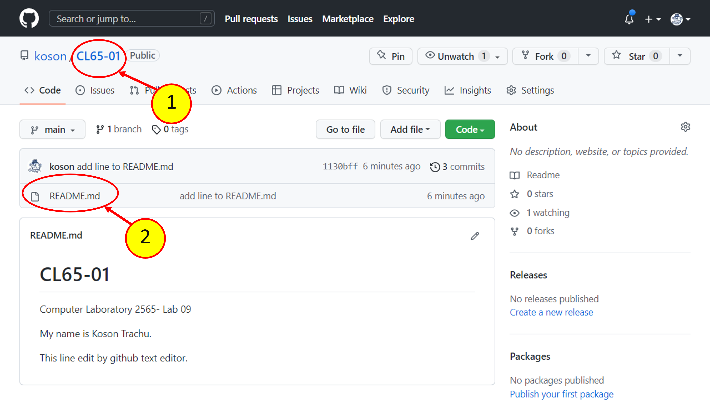
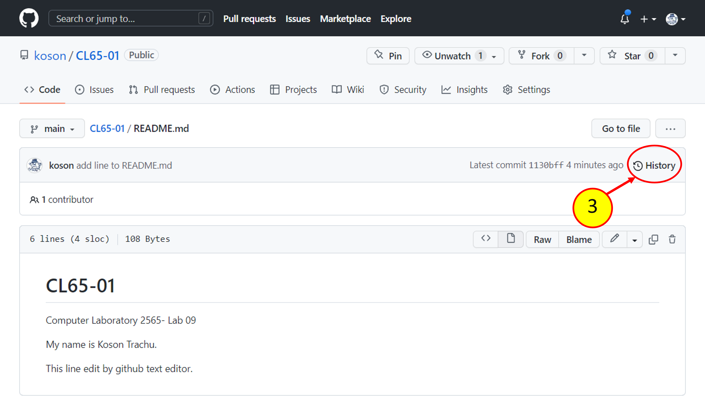
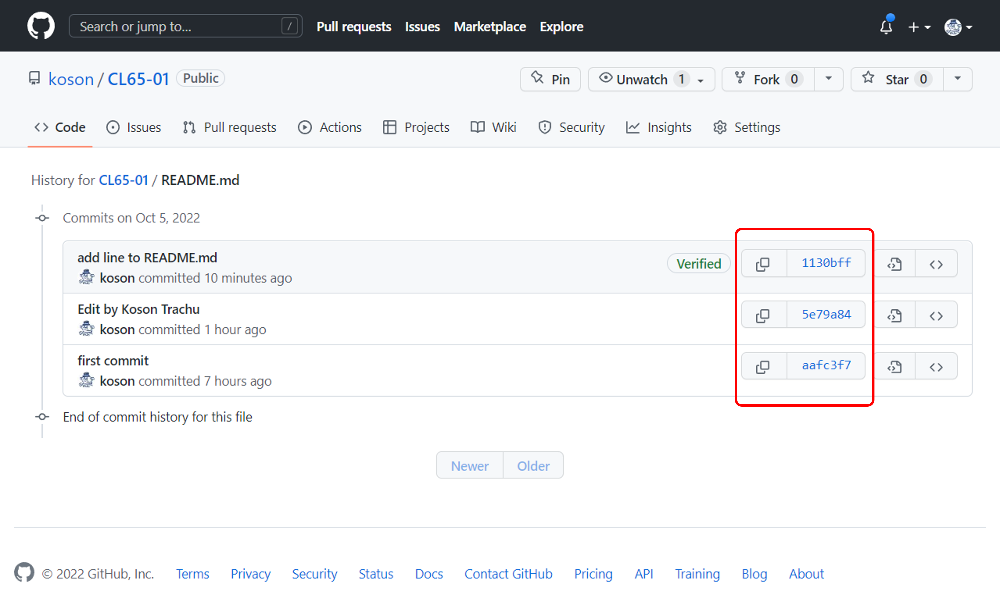
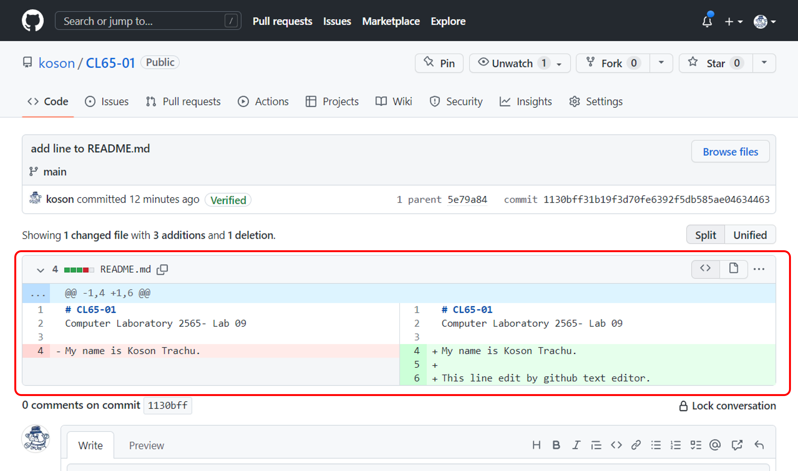

# [Week-09  การทดลองเรื่อง การใช้งาน Repository เบื้องต้น](README.md)

### 1.7 การตรวจสอบประวัติการเปลี่ยนแปลงของไฟล์

-	กลับไปที่ web browser  (1) คลิกที่ชื่อ repository,  (2) คลิกที่ชื่อไฟล์ README.md (3) คลิกปุ่ม History

 

 

 

  <b> รูปที่ 28 </b>การเข้าถึงประวัติของไฟล์
เมื่อคลิกดูประวัติไฟล์ จะพบว่า  ไม่ว่าเราจะแก้ไขไฟล์ที่ไหน แต่ Git จะติดตามและบันทึกการเปลี่ยนแปลงทุกครั้งที่เราทำการ commit

--- 
__ผลการทดลอง__

ให้นักศึกษา  capture  หน้าจอของตนเองมาใส่ และอธิบายสั้นๆ ถึงสิ่งที่เกิดขึ้น

---

 

 

  <b> รูปที่ 29 </b>รายการประวัติการแก้ไขไฟล์

--- 
__ผลการทดลอง__

ให้นักศึกษา  capture  หน้าจอของตนเองมาใส่ และอธิบายสั้นๆ ถึงสิ่งที่เกิดขึ้น

---

ให้คลิกปุ่มที่มีเลขฐาน 16 กำกับ (เป็นชื่อรหัสกำกับการแก้ไข ที่ทีมพัฒนาจะใช้อ้างอิงถึง) ตามลูกศรสีแดงในรูปที่ี 29 เราจะเห็นประวัติการแก้ไขไฟล์ ดังรูปที่ 30

 

 

  <b> รูปที่ 30 </b>ประวัติการแก้ไขไฟล์

--- 
__ผลการทดลอง__

ให้นักศึกษา  capture  หน้าจอของตนเองมาใส่ และอธิบายสั้นๆ ถึงสิ่งที่เกิดขึ้น

---

### [แบบฝึกหัด](6.Assignments.md)
